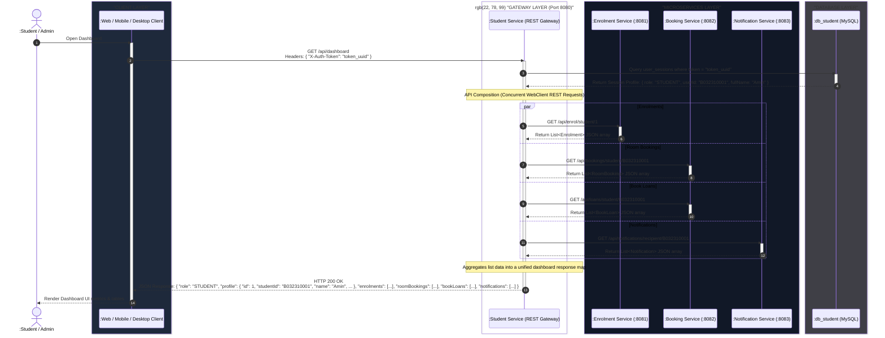
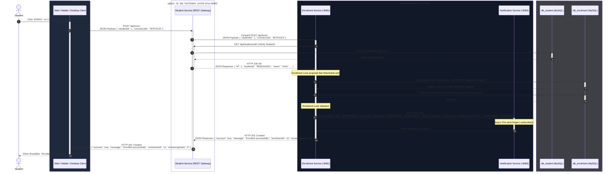
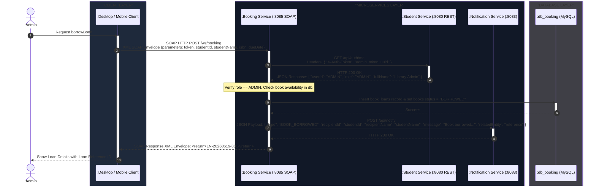
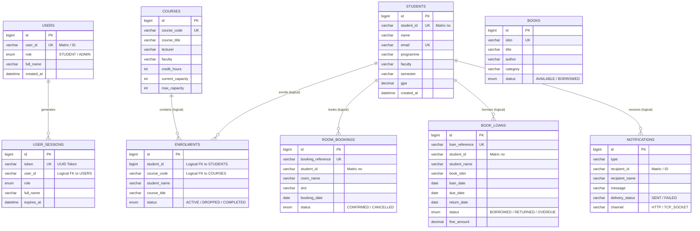

# 🎓 Smart Campus Connect (Microservices Architecture)

SmartCampus Connect is a distributed, multi-platform campus management system. It is designed using a **Microservices / Service-Oriented Architecture (SOA)** featuring database isolation per service, inter-service API orchestration/composition, multithreading protections, and multi-protocol clients (REST + SOAP).

The system integrates three clients (**Web**, **Mobile**, and **Desktop**) communicating with a Spring Boot REST API Gateway and a set of dedicated MySQL databases.

---

## 🏗️ System Architecture (Sequence Diagrams)

These detailed sequence diagrams trace the exact runtime execution flows, service boundaries, protocols, and request/response payloads exchanged between the client apps and backend microservices:

### 1. Dashboard API Composition & Aggregation Flow (Port 8080)


### 2. Fair-Locked Course Enrolment Flow (REST Proxy through Gateway)


### 3. SOAP-Based Library & Booking Flows (Port 8085 JAX-WS)


---


## 🗄️ Database Relationships (ER Diagram)

Each microservice manages its own isolated MySQL database. Relationships are resolved logically via code/API calls rather than physical foreign key constraints.



---

## 🎓 Coursework Compliance Matrix (R1 - R10)

| Requirement | Concept (Week) | Implementation Details & Mapping |
| :--- | :--- | :--- |
| **R1: System Characterisation** | Week 1 | • Decoupled Microservices with location/access transparency via Gateway Proxies.<br>• Graceful degradation using WebClient fallback logic if a service becomes unavailable. |
| **R2: Architectural Pattern** | Week 2 | • **Multi-tier Microservices**: Separates Presentation layer, business processes, and database persistence. |
| **R3: SOA Principles** | Week 3 | • Services separated into: Student, Enrolment, Booking, and Notification.<br>• **Database-per-Service**: Decoupled databases (`db_student`, `db_enrolment`, `db_booking`, `db_notification`). |
| **R4: Service Composition** | Week 3 | • Student Service (Dashboard) orchestrates REST aggregation across enrolment, booking, and notification services via WebClient.<br>• Internal notifications sent using decoupled HTTP post requests. |
| **R5: Multithreaded Server** | Week 4 | • enrolment-service utilizes a fairness-mode `ReentrantLock` to protect course capacity concurrency states during registration load tests. |
| **R6: Distributed Messaging** | Week 5 | • Implements a custom non-blocking notification server listening on TCP Socket port `9090` (Producer-Consumer pattern). |
| **R7: REST API** | Week 6 | • REST APIs exposed via API Gateway controllers at port `8080` (handles proxy routing to `/api/enrol`, `/api/courses`, and `/api/notifications`). |
| **R8: SOAP Service** | Week 7 | • SOAP/WSDL endpoints exposed in `booking-service` at port `8085` using JAX-WS. |
| **R9: Failure Handling** | Weeks 1, 4 | • Isolated microservices prevent cascade failures; failing to query one service fallbacks to empty list data without crashing the dashboard. |
| **R10: Version Control & Build** | Engineering Practice | • Decoupled build containers configured in `docker-compose.yml` allowing single-command startup. |

---

## 🌐 API Reference (REST & SOAP)

### 1. REST API Endpoints (Gateway Port 8080)

All HTTP REST endpoints listed below are routed via the Gateway (`student-service` on port `8080`) to ensure backend location transparency.

| Category | Method | Endpoint / URL | Request Payload (JSON) | Description |
| :--- | :---: | :--- | :--- | :--- |
| **🔐 Auth** | `POST` | `/api/auth/login` | `{ "userId": "B032310001" }` | Logs in a user by ID only (matric number or `ADMIN`). |
| | `GET` | `/api/auth/me` | *None* | Retrieves active session context (requires `X-Auth-Token` header). |
| | `POST` | `/api/auth/logout` | *None* | Invalidates and destroys the active session. |
| **👤 Student** | `GET` | `/api/students` | *None* | Lists all student profiles in the database. |
| | `GET` | `/api/students/{matricNo}` | *None* | Retrieves student profile by matriculation number. |
| | `GET` | `/api/students/id/{id}` | *None* | Retrieves student profile by database ID. |
| | `POST` | `/api/students` | `{ "name": "Amin", "email": "amin@...", "programme": "...", "faculty": "FTMK", "semester": "1", "gpa": 3.60, "phoneNumber": "..." }` | Registers a new student and generates login credentials. |
| | `PUT` | `/api/students/{id}` | `{ "name": "Amin New", "gpa": 3.70 }` | Updates profile info by database ID. |
| | `DELETE` | `/api/students/{id}` | *None* | Deletes student profile and login credentials. |
| **📝 Enrolment**| `GET` | `/api/courses` | *None* | Returns a list of all courses. |
| | `POST` | `/api/courses` | `{ "courseCode": "BITP3123", "courseTitle": "Distributed Apps", "lecturer": "Dr. R", "faculty": "FTMK", "creditHours": 3, "maxCapacity": 30, "semester": "2024/2025 SEM 1" }` | Creates a new course offering. |
| | `POST` | `/api/enrol` | `{ "studentId": 1, "courseCode": "BITP3123" }` | Enrolls a student into a course. Protected by `ReentrantLock`. |
| | `DELETE` | `/api/enrol/{studentId}/{courseCode}`| *None* | Drops a course registration. |
| | `GET` | `/api/enrol/student/{studentId}`| *None* | Gets all course registrations for a student. |
| | `POST` | `/api/enrol/load-test/{courseCode}`| *None* | Triggers load test (10 concurrent threads booking remaining 3 seats). |
| **🔔 Alerts** | `GET` | `/api/notifications` | *None* | Lists all logged system alerts. |
| | `GET` | `/api/notifications/recipient/{id}`| *None* | Retrieves logs for a specific recipient (matric number). |

### 2. SOAP Web Services (Port 8085)

The SOAP service is published directly by `booking-service` at: `http://localhost:8085/ws/booking`.

| Operation Name | Input Parameters | Output / Return | Description |
| :--- | :--- | :--- | :--- |
| `bookRoom` | `studentId`, `studentName`, `roomName`, `slot`, `date`, `purpose` | `String` (Booking Ref) | Confirms a room booking. SOAP Fault if slot is already booked. |
| `checkAvailability`| `roomName`, `slot`, `date` | `boolean` | Checks if a room slot is available. |
| `cancelBooking` | `bookingRef` | `boolean` | Cancels a room booking. |
| `borrowBook` | `token`, `studentId`, `studentName`, `isbn`, `dueDate` | `String` (Loan Ref) | Admin lends a book. |
| `returnBook` | `token`, `loanRef` | `boolean` | Admin records a book return (calculates fine). |
| `addBook` | `token`, `isbn`, `title`, `author`, `category` | `boolean` | Admin adds a book. |
| `searchBooks` | `query` | `List<Book>` | Searches book catalog. |

---

## 🗄️ Data Dictionary

### 1. Database: `db_student` (student-service)

#### Table: `users`
| Column | Type | Constraint | Description |
| :--- | :--- | :--- | :--- |
| `id` | BIGINT | PK, Auto-Increment | Internal surrogate identifier. |
| `user_id` | VARCHAR(20) | Unique, Indexed | Student matric number or `ADMIN`. |
| `role` | ENUM | `STUDENT` / `ADMIN` | User access level. |
| `full_name` | VARCHAR(100) | — | Display name of the user. |
| `created_at` | DATETIME | — | Record creation timestamp. |

#### Table: `user_sessions`
| Column | Type | Constraint | Description |
| :--- | :--- | :--- | :--- |
| `id` | BIGINT | PK, Auto-Increment | Session primary identifier. |
| `token` | VARCHAR(100) | Unique, Indexed | Session UUID token. |
| `user_id` | VARCHAR(20) | Indexed | Target user ID. |
| `role` | ENUM | `STUDENT` / `ADMIN` | Session role. |
| `full_name` | VARCHAR(100) | — | Display name of session owner. |
| `expires_at` | DATETIME | — | Expiration timestamp (default 24 hours). |

#### Table: `students`
| Column | Type | Constraint | Description |
| :--- | :--- | :--- | :--- |
| `id` | BIGINT | PK, Auto-Increment | Student record primary key. |
| `student_id`| VARCHAR(20) | Unique | Matric number (e.g. `B032310001`). |
| `name` | VARCHAR(100) | — | Full name. |
| `email` | VARCHAR(150) | Unique | Student email. |
| `programme` | VARCHAR(100) | — | Major field of study. |
| `faculty` | VARCHAR(50) | — | Faculty identifier (e.g. `FTMK`). |
| `semester` | VARCHAR(10) | — | Current semester. |
| `gpa` | DECIMAL(4,2) | — | Cumulative GPA. |
| `phone_number`| VARCHAR(15) | — | Contact number. |

---

### 2. Database: `db_enrolment` (enrolment-service)

#### Table: `courses`
| Column | Type | Constraint | Description |
| :--- | :--- | :--- | :--- |
| `id` | BIGINT | PK, Auto-Increment | Course identifier. |
| `course_code`| VARCHAR(20) | Unique | Course code (e.g. `BITP3123`). |
| `course_title`| VARCHAR(150)| — | Course name. |
| `lecturer` | VARCHAR(100) | — | Lecturer name. |
| `faculty` | VARCHAR(50) | — | Hosting faculty. |
| `credit_hours`| INT | Default 3 | Credit weight. |
| `current_capacity`| INT | Default 0 | Current enrolled seats. |
| `max_capacity`| INT | Default 30 | Maximum capacity limit. |

#### Table: `enrolments`
| Column | Type | Constraint | Description |
| :--- | :--- | :--- | :--- |
| `id` | BIGINT | PK, Auto-Increment | Enrolment identifier. |
| `student_id`| BIGINT | Composite Unique (with course_code) | Logical reference to Student ID on `db_student`. |
| `course_code`| VARCHAR(20) | Composite Unique (with student_id) | Target course code. |
| `student_name`| VARCHAR(100)| — | Denormalized student name. |
| `course_title`| VARCHAR(150)| — | Denormalized course title. |
| `status` | ENUM | `ACTIVE` / `DROPPED` / `COMPLETED` | Registration status. |

---

### 3. Database: `db_booking` (booking-service)

#### Table: `books`
| Column | Type | Constraint | Description |
| :--- | :--- | :--- | :--- |
| `id` | BIGINT | PK, Auto-Increment | Book ID. |
| `isbn` | VARCHAR(20) | Unique | Book ISBN-13 code. |
| `title` | VARCHAR(200) | — | Book title. |
| `author` | VARCHAR(150) | — | Author name. |
| `category` | VARCHAR(100) | — | Genre/Category. |
| `status` | ENUM | `AVAILABLE` / `BORROWED` | Book status. |

#### Table: `book_loans`
| Column | Type | Constraint | Description |
| :--- | :--- | :--- | :--- |
| `id` | BIGINT | PK, Auto-Increment | Loan identifier. |
| `loan_reference`| VARCHAR(30)| Unique | Unique loan reference (e.g. `LN-XXXXXXXX`). |
| `student_id`| VARCHAR(20) | — | Student matric number. |
| `student_name`| VARCHAR(100)| — | Student name. |
| `book_isbn` | VARCHAR(20) | — | ISBN of the borrowed book. |
| `loan_date` | DATE | — | Loan date. |
| `due_date` | DATE | — | Due deadline date. |
| `return_date`| DATE | Nullable | Actual returned date. |
| `status` | ENUM | `BORROWED` / `RETURNED` / `OVERDUE` | Loan status. |
| `fine_amount`| DECIMAL(8,2)| Default 0.00 | Fine amount (RM1/day overdue). |

#### Table: `room_bookings`
| Column | Type | Constraint | Description |
| :--- | :--- | :--- | :--- |
| `id` | BIGINT | PK, Auto-Increment | Booking identifier. |
| `booking_reference`| VARCHAR(30)| Unique | Unique booking reference (e.g. `BK-XXXXXXXX`). |
| `student_id`| VARCHAR(20) | — | Student matric number. |
| `room_name` | VARCHAR(50) | Composite Unique (with slot & date) | Reserved room name. |
| `slot` | VARCHAR(50) | Composite Unique | Reserved slot. |
| `booking_date`| DATE | Composite Unique | Reserved date. |
| `status` | ENUM | `CONFIRMED` / `CANCELLED` | Booking status. |

---

### 4. Database: `db_notification` (notification-service)

#### Table: `notifications`
| Column | Type | Constraint | Description |
| :--- | :--- | :--- | :--- |
| `id` | BIGINT | PK, Auto-Increment | Notification identifier. |
| `type` | VARCHAR(30) | — | Notification event type. |
| `recipient_id`| VARCHAR(20) | — | Target recipient matric number or `ADMIN`. |
| `recipient_name`| VARCHAR(100)| — | Target recipient name. |
| `message` | VARCHAR(500)| — | Alert content message. |
| `delivery_status`| VARCHAR(10)| — | Status (`SENT` / `FAILED`). |
| `channel` | VARCHAR(20) | — | Transport channel (`HTTP` / `TCP_SOCKET`). |

---

## 🚀 Instruction Guide

Follow these steps to run the various components of the project:

### Step 1: Running the Microservices backend (Docker)

Make sure **Docker Desktop** is open and running in the background.

1. Open your terminal in the root folder of the project (`SmartCampusConnect`).
2. Run docker compose to compile and launch all microservices and databases:
   ```bash
   docker compose up --build -d
   ```
3. Check execution status:
   ```bash
   docker compose ps
   ```

---

### Step 2: Running the Web Client (Vanilla JS)

*   **Option A (Using Docker)**: The Web Client is automatically served and exposed at: [http://localhost:3000](http://localhost:3000).
*   **Option B (Python Local Web Server)**:
     1. Open your terminal in the `web/` folder:
         ```bash
         cd web
         ```
     2. Start the HTTP server:
         ```bash
         python3 -m http.server 3000
         ```
     3. Visit: [http://localhost:3000/index.html](http://localhost:3000/index.html).

**Note:** The Web Client looks for a project logo at `web/omgosh-logo.png`. To display your logo in the dashboard, place a PNG named `omgosh-logo.png` in the `web/` folder or update the path in `web/js/views/dashboard.js`.

### Web changelog (recent)

- Updated web UI: mobile-responsive layout for dashboard, library, login, and profile.
- Restored visible circular spinner and improved loader behavior.
- Added support for `omgosh-logo.png` in the dashboard header (place the file in `web/`).
- Corrected web run instructions and added notes for local serving.

---

### Step 3: Running the Desktop Admin Client (Java Swing)

1. Open your terminal in the `desktop/` folder:
   ```bash
   cd desktop
   ```
2. Compile the Java files:
   * **macOS/Linux:**
     ```bash
     ./compile.sh
     ```
   * **Windows (Command Prompt / PowerShell):**
     ```cmd
     compile.bat
     ```
3. Run the desktop application:
   * **macOS/Linux:**
     ```bash
     ./run.sh
     ```
   * **Windows (Command Prompt / PowerShell):**
     ```cmd
     run.bat
     ```

---

### Step 4: Running the Mobile Client (Flutter)

1. Open your terminal in the `mobile/` folder:
   ```bash
   cd mobile
   ```
2. Get Flutter packages:
   ```bash
   flutter pub get
   ```
3. Connect your device/emulator and run the application:
   ```bash
   flutter run
   ```

---

## 📁 Project Directory Structure

```text
SmartCampusConnect/
├── .env                       # Environment variables config
├── docker-compose.yml         # Docker Compose orchestration
├── backend/                   # ☕ student-service & REST Gateway
├── enrolment-service/         # ☕ enrolment-service (Port 8081)
├── booking-service/           # ☕ booking-service (Port 8082/8085)
├── notification-service/      # ☕ notification-service (Port 8083/9090)
├── web/                       # 🌐 Web Frontend Client
├── mobile/                    # 📱 Mobile Client (Flutter App)
└── desktop/                   # 🖥️ Desktop Client (Java Swing Admin Console)
```