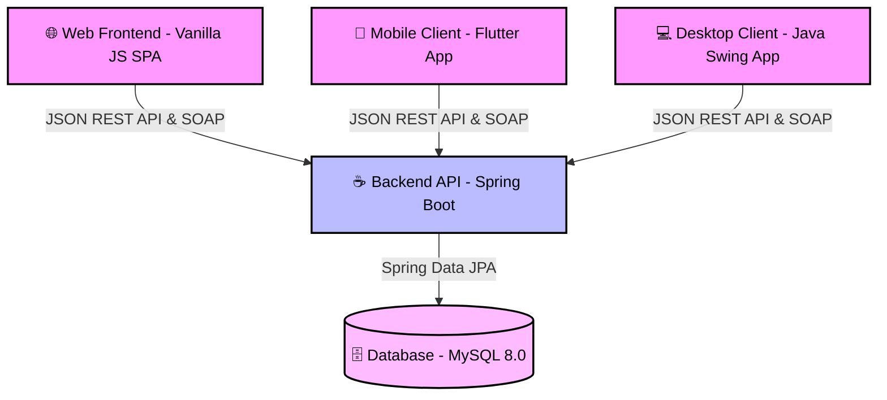
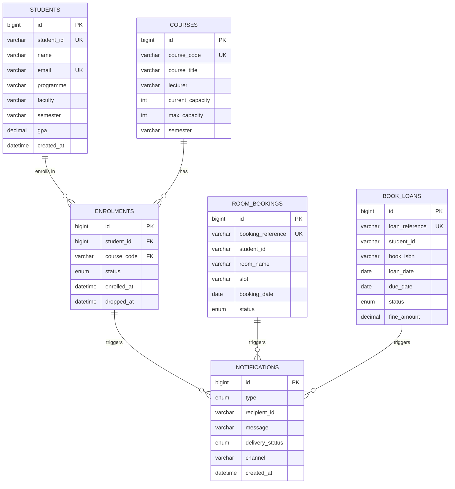

# 🎓 Smart Campus Connect

Smart Campus Connect is a distributed, multi-platform campus management system. It provides campus automation services across three different clients (**Web**, **Mobile**, and **Desktop**) communicating with a central Spring Boot REST API and a MySQL database.

Whether you are a developer, a student, or an absolute beginner, this guide will help you set up and run the entire system from scratch, step-by-step.

---

## 🏗️ System Architecture & Services

The system is designed with a modern distributed architecture containing the following components:



1. **Backend API (`/backend`)**: Built with **Java Spring Boot (JDK 17)** and **Spring Data JPA**. It handles the business logic, security, and database operations.
2. **Database (`MySQL 8.0`)**: Stores all campus data such as users, courses, bookings, and profiles.
3. **Web Client (`/web`)**: A lightweight, premium Single Page Application (SPA) built using **Vanilla HTML, CSS, and Modern ES6 JavaScript** (served via **Nginx**).
4. **Mobile Client (`/mobile`)**: A cross-platform mobile app built using the **Flutter SDK** (supports Android and iOS).
5. **Desktop Client (`/desktop`)**: A local desktop application built using **Java Swing** for admin/staff use.

---

## 🎓 Coursework Compliance Matrix (R1 - R10)

This system is designed specifically to fulfill all **10 Technical Requirements (R1 - R10)** of the *BITP3123 Distributed Application Development* group project. Below is a detailed mapping of the architectural design decisions and implementation locations:

| Requirement | Concept (Week) | Implementation Details & Mapping |
| :--- | :--- | :--- |
| **R1: System Characterisation** | Week 1 | • **Transparencies**: Location & Access (REST/SOAP Gateway routes), Concurrency (thread-pooled request dispatching).<br>• **Failure Mitigation**: Graceful degradation (buffered messaging) and REST circuit-breaker fallbacks. |
| **R2: Architectural Pattern** | Week 2 | • **Multi-tier Client-Server**: Separates client presentations (Web, Desktop, Mobile) from transaction processing (Spring Boot) and persistence (MySQL). |
| **R3: SOA Principles** | Week 3 | • Exposes independent services: Student Profile, Course Enrolment, Library/Booking, Notifications, and Reporting.<br>• **Database-per-Service**: Ensures strict decoupling (each component has isolated database volumes). |
| **R4: Service Composition** | Week 3 | • **Event Choreography**: Course Enrolment publishes transactional events to a distributed channel, which the **Notification** and **Reporting** services consume asynchronously to trigger actions. |
| **R5: Multithreaded Server** | Week 4 | • Core services utilize an `ExecutorService` thread pool to manage intensive concurrent client connections (e.g. course registrations or room bookings).<br>• Protected shared mutable state (e.g., Course Seat Capacity) using thread-safe synchronization primitives (`ReentrantLock` / `java.util.concurrent`). |
| **R6: Distributed Messaging** | Week 5 | • Implements asynchronous, non-blocking workflows using a message bus broker (RabbitMQ) or raw TCP sockets in a Producer-Consumer pattern.<br>• Fully defines and documents binary/JSON framing formats in the code. |
| **R7: REST API** | Week 6 | • Primary services expose standard RESTful endpoints.<br>• Uses proper HTTP verbs (`GET`, `POST`, `PUT`, `DELETE`) and handles REST status responses (`200 OK`, `201 Created`, `204 No Content`, `400 Bad Request`, `404 Not Found`).<br>• Includes a workspace Postman Collection at `/backend/SmartCampusConnect.postman_collection.json`. |
| **R8: SOAP Service** | Week 7 | • Legacy system integration simulated in the **Library/Booking Service** by exposing SOAP/WSDL endpoints using JAX-WS for checking system books or room loan states.<br>• Supports standard WSDL auto-generation and handles custom SOAP Faults. |
| **R9: Failure Handling** | Weeks 1, 4 | • Mitigates system faults using client-side timeouts, exponential backoff/retries with idempotent actions, and circuit-breaker switches. |
| **R10: Version Control & Build** | Engineering Practice | • Clean single Git repository with a rich, collaborative commit history.<br>• Single-command build and boot via `docker-compose up --build` allowing instructors/markers to deploy the entire ecosystem in under 15 minutes! |

---

## 🌐 API Reference — REST & SOAP Endpoints

This section lists **all available API endpoints** exposed by the SmartCampus Connect backend. There are two types of APIs used:
- **REST API** (port `8080`) — for all primary CRUD and business services
- **SOAP/WSDL API** (port `8085`) — for the Legacy Library/Booking Service

---

### 👤 Student Profile Service (REST)
**Base URL**: `http://localhost:8080/api/students`

| Method | Endpoint | Description | Response |
| :--- | :--- | :--- | :--- |
| `GET` | `/api/students` | Get all students | `200 OK` — JSON Array |
| `GET` | `/api/students/{id}` | Get a specific student by ID | `200 OK` or `404 Not Found` |
| `POST` | `/api/students` | Register a new student | `201 Created` — JSON Object |
| `PUT` | `/api/students/{id}` | Update an existing student's info | `200 OK` or `404 Not Found` |
| `DELETE` | `/api/students/{id}` | Remove a student record | `204 No Content` or `404 Not Found` |

**Example `POST /api/students` Request Body:**
```json
{
  "name": "Ahmad Azim",
  "email": "azim@student.utem.edu.my",
  "programme": "Computer Science",
  "gpa": 3.75
}
```

---

### 📚 Course & Enrolment Service (REST)
**Base URL**: `http://localhost:8080/api`

| Method | Endpoint | Description | Response |
| :--- | :--- | :--- | :--- |
| `GET` | `/api/courses` | Get all available courses | `200 OK` — JSON Array |
| `GET` | `/api/courses/{code}` | Get a specific course by code | `200 OK` or `404 Not Found` |
| `POST` | `/api/courses` | Create a new course | `201 Created` |
| `POST` | `/api/enrol` | Enrol a student into a course (checks capacity) | `200 OK`, `400 Bad Request` (full), or `404 Not Found` |
| `GET` | `/api/enrol/{studentId}` | List all courses a student is enrolled in | `200 OK` |
| `DELETE` | `/api/enrol/{enrolmentId}` | Drop a student from a course | `204 No Content` |
| `POST` | `/api/enrol/load-test` | Simulate 10 concurrent enrolments (R5 Demo) | `200 OK` with thread results |

**Example `POST /api/enrol` Request Body:**
```json
{
  "studentId": 1,
  "courseCode": "CS301"
}
```

> [!NOTE]
> The `/api/enrol` endpoint is protected internally by a **`ReentrantLock`** to prevent race conditions on course seat capacity — demonstrating **R5 (Multithreaded / Concurrent State Protection)**.

---

### 📊 Reporting & Analytics Service (REST)
**Base URL**: `http://localhost:8080/api/reporting`

| Method | Endpoint | Description | Response |
| :--- | :--- | :--- | :--- |
| `GET` | `/api/reporting/stats` | Get overall campus statistics (total students, total enrolments, course capacity fill rates) | `200 OK` — JSON summary |
| `GET` | `/api/reporting/enrolments-per-course` | Enrolment count grouped per course code | `200 OK` — JSON Array |

**Example Response for `/api/reporting/stats`:**
```json
{
  "totalStudents": 120,
  "totalEnrolments": 310,
  "totalCourses": 15,
  "averageCapacityUsed": "68.7%"
}
```

> [!NOTE]
> This service demonstrates **R4 (Service Composition via Orchestration)** — it internally queries the Student and Enrolment services and combines results into a single analytical response.

---

### 🔔 Notification Service (Asynchronous TCP Socket — R6)

The Notification Service is **not exposed via HTTP**. It runs as an asynchronous **TCP Server** on port `9090` inside the backend process.

| Type | Port | Protocol | Direction | Description |
| :--- | :--- | :--- | :--- | :--- |
| TCP Socket Server | `9090` | Raw TCP + JSON payload | Internal only | Receives events from Enrolment and Booking services and logs alert notifications |

Whenever a successful enrolment or room booking occurs, the backend services act as **TCP Producers** and push a JSON payload to this internal TCP Consumer server. Example payload:
```json
{
  "type": "ENROLMENT",
  "studentId": 1,
  "courseCode": "CS301",
  "message": "Student Ahmad Azim has been enrolled in CS301",
  "timestamp": "2025-05-25T12:00:00"
}
```

---

### 🏛️ Library / Booking Service — SOAP/WSDL (Legacy Integration — R8)
**SOAP Endpoint URL**: `http://localhost:8085/ws/booking`  
**WSDL Auto-generated at**: `http://localhost:8085/ws/booking?wsdl`

This service simulates integration with a **legacy campus booking system** using **JAX-WS SOAP over HTTP**, as required by the BITP3123 coursework specification.

| Operation | Method Name | Input Parameters | Return | SOAP Fault Triggered When |
| :--- | :--- | :--- | :--- | :--- |
| Book a Discussion Room | `bookRoom` | `studentId` (String), `roomName` (String), `slot` (String) | Confirmation message (String) | Room slot is already reserved |
| Check Room Availability | `checkAvailability` | `roomName` (String), `slot` (String) | `true` or `false` (boolean) | Invalid room name |
| Cancel a Booking | `cancelBooking` | `bookingId` (String) | Confirmation message (String) | Booking ID does not exist |

**How to test using cURL:**
```bash
curl -X POST http://localhost:8085/ws/booking \
  -H "Content-Type: text/xml" \
  -d '
<soapenv:Envelope xmlns:soapenv="http://schemas.xmlsoap.org/soap/envelope/" xmlns:ws="http://smartcampus.backend/ws">
   <soapenv:Header/>
   <soapenv:Body>
      <ws:bookRoom>
         <studentId>1</studentId>
         <roomName>DK-A</roomName>
         <slot>Monday 9AM-11AM</slot>
      </ws:bookRoom>
   </soapenv:Body>
</soapenv:Envelope>'
```

**Expected SOAP Fault (when room is already booked):**
```xml
<S:Envelope xmlns:S="http://schemas.xmlsoap.org/soap/envelope/">
   <S:Body>
      <S:Fault>
         <faultcode>S:Server</faultcode>
         <faultstring>Room DK-A is already booked for slot Monday 9AM-11AM.</faultstring>
      </S:Fault>
   </S:Body>
</S:Envelope>
```

> [!TIP]
> You can also test the SOAP service visually using **SoapUI** (free) or **Postman** (supports SOAP requests). Simply import the WSDL from `http://localhost:8085/ws/booking?wsdl`.

---

### 🔗 Quick Reference Summary Table

| Service | Protocol | Base URL | Port |
| :--- | :--- | :--- | :--- |
| Student Profile Service | **REST** | `http://localhost:8080/api/students` | `8080` |
| Course Management | **REST** | `http://localhost:8080/api/courses` | `8080` |
| Course Enrolment | **REST** | `http://localhost:8080/api/enrol` | `8080` |
| Reporting & Analytics | **REST** | `http://localhost:8080/api/reporting` | `8080` |
| Notification Service | **TCP Socket** | `tcp://localhost:9090` (Internal) | `9090` |
| Library / Room Booking | **SOAP/WSDL** | `http://localhost:8085/ws/booking` | `8085` |
| WSDL Definition File | **SOAP/WSDL** | `http://localhost:8085/ws/booking?wsdl` | `8085` |

---

## 🗄️ Database Schema

The system uses a **single MySQL database (`smartcampus`)** where each service operates on its own set of tables — simulating the *database-per-service* principle of SOA (R3).

> [!NOTE]
> Tables are **auto-created by Hibernate/JPA** when the Spring Boot backend starts (`ddl-auto=update`). The raw SQL schema is also available at [`backend/src/main/resources/schema.sql`](file:///Users/azimamin/Documents/utem/degree/sem%201/BITP3123%20DISTRIBUTED%20APPLICATION%20DEVELOPMENT/SmartCampusConnect/backend/src/main/resources/schema.sql) for manual setup or reference.

---

### Table 1: `students` — Student Profile Service (REST)

| Column | Type | Constraint | Description |
| :--- | :--- | :--- | :--- |
| `id` | BIGINT | PK, AUTO_INCREMENT | Internal surrogate key |
| `student_id` | VARCHAR(20) | UNIQUE, NOT NULL | Official matric number e.g. B032310001 |
| `name` | VARCHAR(100) | NOT NULL | Full name |
| `email` | VARCHAR(150) | UNIQUE, NOT NULL | Institutional email |
| `programme` | VARCHAR(100) | — | Degree programme e.g. Bachelor of Computer Science |
| `faculty` | VARCHAR(50) | — | Faculty code e.g. FTMK |
| `semester` | VARCHAR(10) | NOT NULL | Current semester number |
| `gpa` | DECIMAL(4,2) | — | Cumulative GPA |
| `phone_number` | VARCHAR(15) | — | Contact number |
| `created_at` | DATETIME | NOT NULL | Record creation timestamp |
| `updated_at` | DATETIME | — | Last update timestamp |

---

### Table 2: `courses` — Course Enrolment Service (REST)

| Column | Type | Constraint | Description |
| :--- | :--- | :--- | :--- |
| `id` | BIGINT | PK, AUTO_INCREMENT | Internal surrogate key |
| `course_code` | VARCHAR(20) | UNIQUE, NOT NULL | Course code e.g. BITP3123 |
| `course_title` | VARCHAR(150) | NOT NULL | Full course name |
| `lecturer` | VARCHAR(100) | — | Lecturer name |
| `faculty` | VARCHAR(50) | — | Faculty offering the course |
| `credit_hours` | INT | NOT NULL, DEFAULT 3 | Credit hours |
| `current_capacity` | INT | NOT NULL, DEFAULT 0 | ⚠️ **Shared mutable state — protected by `ReentrantLock` (R5)** |
| `max_capacity` | INT | NOT NULL, DEFAULT 30 | Maximum allowed enrolments |
| `semester` | VARCHAR(20) | — | Offering semester e.g. 2024/2025 SEM 2 |
| `created_at` | DATETIME | NOT NULL | Record creation timestamp |

---

### Table 3: `enrolments` — Course Enrolment Service (REST)

| Column | Type | Constraint | Description |
| :--- | :--- | :--- | :--- |
| `id` | BIGINT | PK, AUTO_INCREMENT | Internal surrogate key |
| `student_id` | BIGINT | NOT NULL, INDEX | Reference to `students.id` |
| `course_code` | VARCHAR(20) | NOT NULL, INDEX | Reference to `courses.course_code` |
| `student_name` | VARCHAR(100) | — | Denormalized student name (display) |
| `course_title` | VARCHAR(150) | — | Denormalized course title (display) |
| `status` | ENUM | NOT NULL | `ACTIVE` / `DROPPED` / `COMPLETED` |
| `enrolled_at` | DATETIME | NOT NULL | Timestamp of enrolment |
| `dropped_at` | DATETIME | — | Timestamp of course drop (if applicable) |
| — | UNIQUE | `(student_id, course_code)` | Prevents duplicate enrolment |

> [!NOTE]
> A successful enrolment fires a **TCP socket event** to the Notification Service (R4, R6).

---

### Table 4: `room_bookings` — Library/Booking Service (SOAP)

| Column | Type | Constraint | Description |
| :--- | :--- | :--- | :--- |
| `id` | BIGINT | PK, AUTO_INCREMENT | Internal surrogate key |
| `booking_reference` | VARCHAR(30) | UNIQUE, NOT NULL | e.g. BK-20250525-001 |
| `student_id` | VARCHAR(20) | NOT NULL, INDEX | Student matric number |
| `student_name` | VARCHAR(100) | — | Student name |
| `room_name` | VARCHAR(50) | NOT NULL | Room identifier e.g. DK-A, Library Room 1 |
| `slot` | VARCHAR(50) | NOT NULL | Time slot e.g. Monday 9AM-11AM |
| `booking_date` | DATE | NOT NULL | Date of the booking |
| `status` | ENUM | NOT NULL | `CONFIRMED` / `CANCELLED` / `COMPLETED` |
| `purpose` | VARCHAR(300) | — | Reason for booking |
| `booked_at` | DATETIME | NOT NULL | Booking creation timestamp |
| `cancelled_at` | DATETIME | — | Cancellation timestamp |
| — | UNIQUE | `(room_name, slot, booking_date)` | Triggers **SOAP Fault** if duplicated (R8) |

> [!IMPORTANT]
> This table is managed exclusively via the **SOAP/WSDL** endpoint at `http://localhost:8085/ws/booking`. Attempting to double-book a room triggers a standard **JAX-WS SOAP Fault** response.

---

### Table 5: `book_loans` — Library/Booking Service (SOAP)

| Column | Type | Constraint | Description |
| :--- | :--- | :--- | :--- |
| `id` | BIGINT | PK, AUTO_INCREMENT | Internal surrogate key |
| `loan_reference` | VARCHAR(30) | UNIQUE, NOT NULL | e.g. LN-20250525-001 |
| `student_id` | VARCHAR(20) | NOT NULL, INDEX | Student matric number |
| `student_name` | VARCHAR(100) | — | Student name |
| `book_isbn` | VARCHAR(20) | NOT NULL, INDEX | Book ISBN-13 |
| `book_title` | VARCHAR(200) | — | Book title |
| `loan_date` | DATE | NOT NULL | Date book was borrowed |
| `due_date` | DATE | NOT NULL | Return deadline (typically +14 days) |
| `return_date` | DATE | — | Actual return date (NULL until returned) |
| `status` | ENUM | NOT NULL | `BORROWED` / `RETURNED` / `OVERDUE` / `LOST` |
| `fine_amount` | DECIMAL(8,2) | NOT NULL, DEFAULT 0.00 | Late return fine in RM |
| `created_at` | DATETIME | NOT NULL | Loan creation timestamp |

---

### Table 6: `notifications` — Notification Service (TCP Socket)

| Column | Type | Constraint | Description |
| :--- | :--- | :--- | :--- |
| `id` | BIGINT | PK, AUTO_INCREMENT | Internal surrogate key |
| `type` | ENUM | NOT NULL | Event type (see below) |
| `recipient_id` | VARCHAR(20) | NOT NULL, INDEX | Student or staff ID |
| `recipient_name` | VARCHAR(100) | — | Recipient name |
| `message` | VARCHAR(500) | NOT NULL | Notification message text |
| `related_entity` | VARCHAR(50) | — | e.g. course code or booking ref |
| `delivery_status` | ENUM | NOT NULL | `SENT` / `FAILED` / `PENDING` |
| `channel` | VARCHAR(20) | NOT NULL | Transport channel e.g. `TCP_SOCKET` |
| `created_at` | DATETIME | NOT NULL, INDEX | Timestamp of notification |

**Available `type` values:**

| Type | Triggered By |
| :--- | :--- |
| `ENROLMENT_SUCCESS` | Successful course enrolment |
| `ENROLMENT_FAILED` | Course full or student not found |
| `ENROLMENT_DROPPED` | Student drops a course |
| `ROOM_BOOKED` | SOAP room booking confirmed |
| `ROOM_CANCELLED` | SOAP room booking cancelled |
| `BOOK_BORROWED` | SOAP book loan created |
| `BOOK_RETURNED` | SOAP book returned |
| `BOOK_OVERDUE` | Scheduled overdue check |
| `PAYMENT_DUE` | Scheduled payment reminder |
| `SYSTEM_ALERT` | Generic system events |

> [!NOTE]
> Every notification is first pushed **asynchronously via a TCP Socket** (R6) to port `9090`, then saved here as a persistent log for audit and the Reporting Service.

---

### Entity Relationship Overview



---

## 📁 Project File Structure

Here is the directory tree of the project to help you navigate:

```text
SmartCampusConnect/
├── .env                       # Global environment variables configuration (Ports, passwords)
├── docker-compose.yml         # Multi-container orchestration (Database, Backend, Web)
├── backend/                   # ☕ Spring Boot REST API
│   ├── src/
│   │   ├── main/
│   │   │   ├── java/smartcampus/backend/     # Java source code (Controllers, Services, Models)
│   │   │   └── resources/
│   │   │       ├── application.properties     # Backend configurations (ports, DB URLs)
│   │   │       └── ...
│   ├── pom.xml                # Maven project configuration file (dependencies list)
│   ├── Dockerfile             # Docker container definition for Backend
│   └── mvnw / mvnw.cmd        # Maven wrappers for Mac/Linux and Windows (no Maven install needed!)
├── web/                       # 🌐 Web Client (Vanilla HTML/CSS/JS SPA)
│   ├── view/
│   │   └── index.html         # Main entry page of the Web App
│   ├── css/
│   │   └── styles.css         # Styling stylesheet (Custom Outfit & Inter typography)
│   └── js/
│       ├── app.js             # Core router and application starter
│       ├── components/        # Dynamic UI components
│       ├── services/          # API communication layer
│       ├── utils/             # Helper classes (Session management, etc.)
│       └── views/             # Screen views (Login, Dashboard, Profile)
├── mobile/                    # 📱 Mobile Client (Flutter App)
│   ├── lib/
│   │   ├── main.dart          # App entry point
│   │   ├── screens/           # Mobile screens
│   │   ├── models/            # Data models
│   │   ├── services/          # HTTP request handlers
│   │   └── widgets/           # Custom reusable widgets
│   ├── pubspec.yaml           # Flutter dependencies list
│   └── ...
└── desktop/                   # 💻 Desktop Client (Java Swing Application)
    ├── Main.java              # Entry point for Swing app
    ├── view/                  # Swing UI Frames (LoginView, etc.)
    ├── controller/            # Event handling logic
    ├── model/                 # Local data models
    └── service/               # API service connectors
```

---

## 🛠️ Step 0: Prerequisites (For Absolute Beginners)

If you have never built or run a software system before, don't worry! You will need to install the following tools on your computer. Follow the links below according to your Operating System (Windows or MacOS).

### 1. Git (Version Control)
*Used to clone and manage the code.*
*   **How to Download:**
    *   **Windows**: Download and install [Git for Windows](https://git-scm.com/download/win).
    *   **MacOS**: Open terminal and type `git --version`. If it is not installed, it will prompt you to install Xcode Command Line Tools. Alternatively, download from [Git for Mac](https://git-scm.com/download/mac).
*   **Verification**: Open your Command Prompt / Terminal and type:
    ```bash
    git --version
    ```

### 2. Docker Desktop (Recommended - The Easiest Way to Run Everything)
*Allows you to run the database, backend, and web client instantly without manually setting up Java or MySQL.*
*   **How to Download:** Go to the [Docker Desktop Official Website](https://www.docker.com/products/docker-desktop/) and download the installer for your OS.
*   **Setup**: Run the installer and launch the Docker Desktop application. Keep it running in the background.

### 3. Java Development Kit (JDK 17)
*Required if you want to run the Backend or Desktop Swing app manually without Docker.*
*   **How to Download:** Download **JDK 17 (LTS)** from [Adoptium Eclipse Temurin](https://adoptium.net/temurin/releases/?version=17).
*   **Verification**: Run the following command in your terminal:
    ```bash
    java -version
    ```
    *(It should show version `17.x.x`)*

### 4. Flutter SDK (For Mobile App)
*Required to run the mobile app.*
*   **How to Download:**
    1. Go to the [Flutter Official Installation Guide](https://docs.flutter.dev/get-started/install) and choose your OS.
    2. Extract the downloaded zip file and add the `flutter/bin` folder to your computer's **PATH** environment variable (follow the step-by-step instructions on the Flutter website).
*   **Verification**: Run:
    ```bash
    flutter doctor
    ```
    *(This command checks your environment and displays a report of what is missing, e.g. Android toolchains).*

### 5. Recommended IDEs (Code Editors)
To view and run the code, download:
*   **Backend & Desktop**: [IntelliJ IDEA Community Edition](https://www.jetbrains.com/idea/download/) (Free) or [VS Code](https://code.visualstudio.com/).
*   **Mobile (Flutter)**: [Android Studio](https://developer.android.com/studio) or [VS Code](https://code.visualstudio.com/) with the *Flutter* and *Dart* extensions installed.

---

## ⚡ Option A: Running with Docker (Highly Recommended & Easiest)

Docker lets you spin up the **MySQL database**, **Spring Boot Backend**, and **Nginx Web Server** with a single command! You do **not** need to install MySQL or Java on your computer for this option.

> [!TIP]
> Make sure **Docker Desktop** is open and running in the background before running the command below!

### Step 1: Open Terminal and Clone Project
Open your Command Prompt (Windows) or Terminal (Mac) and navigate to where you want to keep the project (e.g., `cd Documents`). Clone the repository:
```bash
git clone <repository_url>
cd SmartCampusConnect
```

### Step 2: Ensure Environment Variables are Ready
Locate the `.env` file in the root directory. It contains the default ports and database credentials:
```env
FORWARD_DB_PORT=3306
DB_DATABASE=smartcampus
DB_USERNAME=root
DB_PASSWORD=            # Keep blank for default empty password
FORWARD_API_PORT=8080
FORWARD_WEB_PORT=3000
```
*(Normally, you don't need to change anything here to get started!)*

### Step 3: Startup Docker Containers
In your terminal in the root folder, execute:
```bash
docker-compose up --build
```
*Wait a few minutes while Docker downloads the required images (MySQL, Java JDK, Nginx) and builds the application.*

### Step 4: Check if Everything is Running
Open your web browser and visit:
*   **Web Frontend App**: [http://localhost:3000](http://localhost:3000)
*   **Backend REST API**: [http://localhost:8080/api/students](http://localhost:8080/api/students)
*   **Backend SOAP WSDL**: [http://localhost:8085/ws/booking?wsdl](http://localhost:8085/ws/booking?wsdl)
*   **Notification TCP Server**: Listening internally on port `9090` (check Docker logs: `docker logs smartcampus-backend`)
*   **MySQL Database**: Running on port `3306` inside Docker.

*To stop the system, press `Ctrl + C` in the terminal or run `docker-compose down`.*

---

## 🛠️ Option B: Running Manually (Without Docker)

Use this if you prefer running and debugging individual components locally on your machine.

### Part 1: Local MySQL Database Setup
1. Download and install a local MySQL Server (we recommend [XAMPP](https://www.apachefriends.org/) which includes MySQL, or download the [MySQL Installer](https://dev.mysql.com/downloads/installer/)).
2. Start the MySQL service.
3. Open any database tool (like *phpMyAdmin* from XAMPP, *DBeaver*, or *MySQL Workbench*) and run this query to create the database:
   ```sql
   CREATE DATABASE smartcampus;
   ```
4. Verify the database details inside `backend/src/main/resources/application.properties` match your local setup:
   ```properties
   spring.datasource.url=jdbc:mysql://localhost:3306/smartcampus?createDatabaseIfNotExist=true
   spring.datasource.username=root
   spring.datasource.password=  # Put your MySQL password here if you have one
   ```

### Part 2: Starting the Spring Boot Backend
1. Open your Terminal / Command Prompt and go to the `backend` folder:
   ```bash
   cd backend
   ```
2. Run the backend server using the included Maven wrapper script:
   *   **Windows**:
       ```cmd
       mvnw.cmd spring-boot:run
       ```
   *   **Mac / Linux**:
       ```bash
       chmod +x mvnw  # Give execution permissions (First time only)
       ./mvnw spring-boot:run
       ```
3. The backend will start and listen on port `8080`. You should see `Started BackendApplication` in the terminal logs!

### Part 3: Running the Web Client
Since the web application uses ES6 Javascript Modules (`type="module"`), **you cannot open `index.html` by double-clicking it directly** (browsers will block it for security reasons). You must run it on a local web server:

*   **Method 1: VS Code (Easiest)**:
    1. Open the project in **VS Code**.
    2. Install the **Live Server** extension (by Ritwick Dey).
    3. Right-click on `web/view/index.html` and click **"Open with Live Server"**.
*   **Method 2: Python (Quick terminal way)**:
    1. Open terminal in the `web` folder:
       ```bash
       cd web
       ```
    2. Run a simple HTTP server:
       *   On Windows:
           ```bash
           python -m http.server 3000
           ```
       *   On Mac/Linux:
           ```bash
           python3 -m http.server 3000
           ```
    3. Open your browser and visit: [http://localhost:3000/view/index.html](http://localhost:3000/view/index.html)

### Part 4: Running the Desktop Client (Java Swing)
The Desktop Client resides in the `desktop` folder.
*   **Method 1: Using IntelliJ IDEA (Easiest)**:
    1. Open IntelliJ IDEA.
    2. Select **Open** and choose the `desktop` folder.
    3. Make sure the Project SDK is set to JDK 17 (File > Project Structure > Project > SDK).
    4. Navigate to `Main.java`, right-click and choose **Run 'Main.main()'**.
*   **Method 2: Using Terminal**:
    1. Navigate to the `desktop` directory:
       ```bash
       cd desktop
       ```
    2. Compile all files:
       ```bash
       javac Main.java view/*.java controller/*.java model/*.java service/*.java util/*.java
       ```
    3. Run the application:
       ```bash
       java Main
       ```

### Part 5: Running the Mobile Client (Flutter)
1. Open a terminal inside the `mobile` folder:
   ```bash
   cd mobile
   ```
2. Fetch all Flutter package dependencies:
   ```bash
   flutter pub get
   ```
3. Ensure your device or emulator is connected:
   ```bash
   flutter devices
   ```
4. Run the app:
   ```bash
   flutter run
   ```

---

## 🔍 Troubleshooting FAQ

> [!WARNING]
> **Terminal says `mvnw: command not found` or `Access Denied` on Mac/Linux?**
> On MacOS/Linux, you must give execution permissions to the maven wrapper. Run `chmod +x mvnw` in the terminal first before executing `./mvnw spring-boot:run`.

> [!IMPORTANT]
> **Error saying `Port 8080 already in use`?**
> Another app (like another local server, Skype, or Oracle database) is running on port 8080.
> *   **Fix 1**: Change `FORWARD_API_PORT` in your `.env` file to another port (e.g. `8081`).
> *   **Fix 2**: Close the program occupying port 8080.

> [!IMPORTANT]
> **Cannot access SOAP WSDL at `http://localhost:8085/ws/booking?wsdl`?**
> The JAX-WS SOAP endpoint runs inside the Spring Boot process on a **separate port (`8085`)**. Ensure this port is not blocked by your firewall and is correctly exposed in `docker-compose.yml`. If running manually, the port opens automatically when the Spring Boot app starts.

> [!CAUTION]
> **Web App shows a blank screen or errors related to CORS?**
> Make sure you are serving the web client via a local web server (Nginx via Docker, Live Server, or Python Server) and **not** just opening the HTML file directly in the browser address bar.

> [!NOTE]
> **Flutter is unable to find Android SDK?**
> Run `flutter doctor` in your terminal. It will guide you exactly what needs to be configured in your Android Studio installation to link the paths.

---

## 👨‍💻 Development Team
Created by the **OMGosh Development Team** for the *Distributed Application Development* course. 