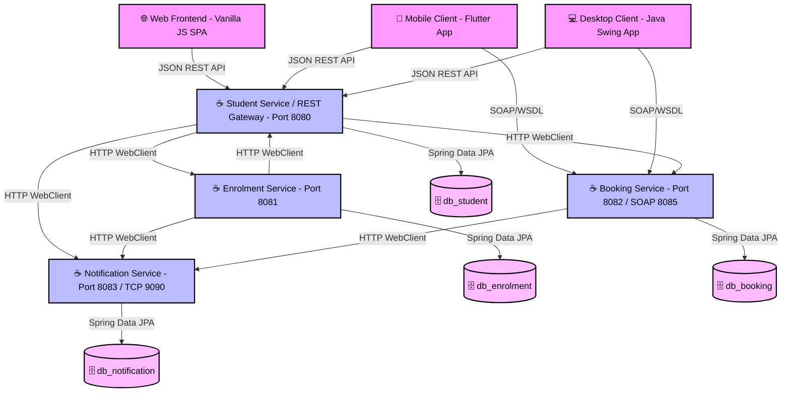

# 🎓 Smart Campus Connect (Microservices Architecture)

SmartCampus Connect is a distributed, multi-platform campus management system. It has been refactored from a monolithic backend to a fully decoupled **Microservices / Service-Oriented Architecture (SOA)**, satisfying database isolation per service, inter-service API orchestration/composition, multithreading protections, and multi-protocol clients (REST + SOAP).

It provides campus automation services across three different clients (**Web**, **Mobile**, and **Desktop**) communicating with the gateway microservice API and a set of dedicated MySQL databases.

---

## 🏗️ System Architecture & Services

The system is designed with a decoupled microservices architecture containing the following components:



1. **Student Service (`/backend`) [Port 8080]**: Handles student profiles, authentication, sessions, acts as the API Gateway/Proxy, and hosts the Personal Dashboard aggregator. Connects to `db_student`.
2. **Enrolment Service (`/enrolment-service`) [Port 8081]**: Exposes course registration, capacity checks, and load test endpoints. Connects to `db_enrolment`.
3. **Booking Service (`/booking-service`) [Port 8082 REST / Port 8085 SOAP]**: Exposes library catalog Search and Room/Book bookings. Connects to `db_booking`.
4. **Notification Service (`/notification-service`) [Port 8083 HTTP / Port 9090 TCP]**: Implements the asynchronous notification logger. Connects to `db_notification`.
5. **Web Client (`/web`)**: Served via **Nginx** on port `3000`.
6. **Mobile Client (`/mobile`)**: Flutter client calling REST APIs via the gateway and SOAP via port 8085.
7. **Desktop Client (`/desktop`)**: Swing client calling REST APIs via the gateway and SOAP via port 8085.

---

## 🎓 Coursework Compliance Matrix (R1 - R10)

| Requirement | Concept (Week) | Implementation Details & Mapping |
| :--- | :--- | :--- |
| **R1: System Characterisation** | Week 1 | • Decoupled Microservices with location/access transparency via Gateway Proxies.<br>• Graceful degradation and connection mitigation using decoupled HTTP WebClient fallbacks. |
| **R2: Architectural Pattern** | Week 2 | • **Multi-tier Microservices**: Separates client presentations from business logic layers and isolates persistence stores. |
| **R3: SOA Principles** | Week 3 | • Strict separation of services: Student, Enrolment, Booking/Library, and Notifications.<br>• **Database-per-Service**: Decoupled databases (`db_student`, `db_enrolment`, `db_booking`, `db_notification`). |
| **R4: Service Composition** | Week 3 | • Student Service (Dashboard) orchestrates REST aggregation across three other microservices to render the client personal board.<br>• Enrolment and Booking services compose with Notification Service via async-like HTTP calls. |
| **R5: Multithreaded Server** | Week 4 | • enrolment-service utilizes a fairness-mode `ReentrantLock` to protect course capacity concurrency states during registration load tests. |
| **R6: Distributed Messaging** | Week 5 | • Implements a custom non-blocking notification server listening on TCP Socket port `9090` (Producer-Consumer pattern). |
| **R7: REST API** | Week 6 | • Microservices expose clean HTTP/REST APIs. Gateway Proxy Controllers routing to `/api/enrol`, `/api/courses`, and `/api/notifications` ensure complete frontend compatibility. |
| **R8: SOAP Service** | Week 7 | • Legacy system SOAP/WSDL endpoints exposed in **booking-service** on port `8085` using JAX-WS. |
| **R9: Failure Handling** | Weeks 1, 4 | • Isolated microservices prevent cascade failures; failing to query one service fallback to empty list data without crashing the dashboard. |
| **R10: Version Control & Build** | Engineering Practice | • Decoupled build containers configured in `docker-compose.yml` allowing single-command startup. |

---

## ⚡ Running with Docker (Highly Recommended)

Make sure **Docker Desktop** is open and running, then execute:

```bash
docker-compose up --build
```

### Port Mappings on Host:
*   **Web Frontend App**: [http://localhost:3000](http://localhost:3000)
*   **Student Service / Gateway API**: [http://localhost:8080](http://localhost:8080)
*   **Enrolment Service**: [http://localhost:8081](http://localhost:8081)
*   **Booking Service (REST)**: [http://localhost:8082](http://localhost:8082)
*   **SOAP Endpoint**: [http://localhost:8085/ws/booking?wsdl](http://localhost:8085/ws/booking?wsdl)
*   **Notification Service (HTTP)**: [http://localhost:8083](http://localhost:8083)
*   **Notification Service (TCP)**: [tcp://localhost:9090](tcp://localhost:9090)

---

## 📁 Project File Structure

```text
SmartCampusConnect/
├── .env                       # Global environment ports & database credentials
├── docker-compose.yml         # 4 Microservices + 4 isolated DBs setup
├── backend/                   # ☕ Student Service & REST Gateway Gateway
├── enrolment-service/         # ☕ Enrolment Microservice
├── booking-service/           # ☕ Booking & SOAP Microservice
├── notification-service/      # ☕ Notification & TCP Microservice
├── web/                       # 🌐 Web Client SPA
├── mobile/                    # 📱 Mobile Client (Flutter)
└── desktop/                   # 💻 Desktop Client (Java Swing)
```

For legacy manual running instructions, consult the individual subdirectories.