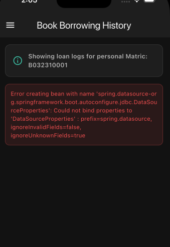
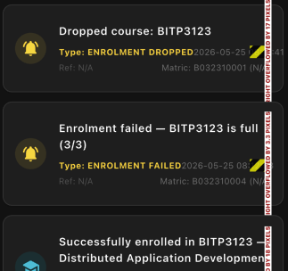

# 🎓 Smart Campus Connect (Microservices Architecture)

SmartCampus Connect ialah sistem pengurusan kampus teragih berasaskan **Seni Bina Microservices (SOA)**. Monolit asal telah dipecahkan kepada **4 microservice berasingan** dengan pangkalan data tersendiri (*Database-per-Service*), menyokong komunikasi REST + SOAP, serta diintegrasikan dengan aplikasi **Web**, **Mobile (Flutter)**, dan **Desktop (Java Swing)**.

---

## 🏗️ Rajah Seni Bina Sistem (System Architecture)



---

## 📋 Keperluan Kursus & Pematuhan Matriks (R1 - R10)

| ID Keperluan | Perincian Teknikal & Implementasi |
| :--- | :--- |
| **R1: System Characterisation** | • Menyokong ketelusan lokasi & akses melalui API Gateway / Proxy.<br>• Sistem terus berfungsi (graceful degradation) menggunakan HTTP WebClient fallback jika salah satu servis terputus. |
| **R2: Architectural Pattern** | • Pembahagian jelas antara lapisan Presentation (Web, Mobile, Desktop), Business Logic (Microservices), dan Persistence (MySQL). |
| **R3: SOA Principles** | • Strict decoupling kepada 4 servis utama: Student, Enrolment, Booking, dan Notification.<br>• Pangkalan data terasing bagi setiap servis (`db_student`, `db_enrolment`, `db_booking`, `db_notification`). |
| **R4: Service Composition** | • **Student Service (Gateway)** menggabungkan (aggregate) data profil, subjek, tempahan, dan notifikasi dari semua microservices ke personal dashboard.<br>• Servis lain berinteraksi secara dinamik melalui HTTP REST calls. |
| **R5: Multithreaded Server** | • `enrolment-service` menggunakan **`ReentrantLock` (fairness-mode)** untuk mengawal baki tempat bagi pendaftaran subjek secara selamat semasa demo concurrency (10 threads serentak). |
| **R6: Distributed Messaging** | • Sistem alert sokongan **TCP Socket** (port `9090`) dipasang di `notification-service` beroperasi secara asynchronous (Producer-Consumer pattern). |
| **R7: REST API** | • Pendedahan API RESTful seragam di port `8080` (Gateway). Menyokong HTTP verbs (`GET`, `POST`, `PUT`, `DELETE`). |
| **R8: SOAP Service** | • SOAP legacy Web Service dikekalkan di port `8085` (`booking-service`) menggunakan JAX-WS untuk carian katalog, pinjaman buku, dan tempahan bilik. |
| **R9: Failure Handling** | • Isolasi kegagalan di mana dashboard pelajar masih boleh dibuka dengan selamat walaupun `booking-service` atau `enrolment-service` terhenti. |
| **R10: Version Control & Build** | • Automasi penuh menggunakan Docker Compose. Sistem database dan server sedia dijalankan dalam masa kurang 5 minit. |

---

## 🌐 API Reference (REST & SOAP)

### 1. REST API Endpoints (Gateway Port 8080)

Semua request dari aplikasi dialihkan melalui Gateway (`student-service`) pada port **8080** secara lut sinar (transparent).

| Servis / Kategori | Method | Endpoint / URL | Request Payload (JSON) | Deskripsi |
| :--- | :---: | :--- | :--- | :--- |
| **🔐 Authentication** | `POST` | `/api/auth/login` | `{ "userId": "B032310001" }` | Log masuk menggunakan no. matrik / ADMIN. Mengembalikan token UUID. |
| | `GET` | `/api/auth/me` | *Tiada* | Memeriksa sesi aktif berdasarkan header `X-Auth-Token`. |
| | `POST` | `/api/auth/logout` | *Tiada* | Memadam sesi aktif dan mematikan token di database. |
| **👤 Student Profile** | `GET` | `/api/students` | *Tiada* | Mendapatkan senarai semua profil pelajar. |
| | `GET` | `/api/students/{matricNo}` | *Tiada* | Carian profil pelajar berdasarkan nombor matrik. |
| | `GET` | `/api/students/id/{id}` | *Tiada* | Carian profil pelajar menggunakan ID database (kegunaan dalaman). |
| | `POST` | `/api/students` | `{ "name": "Amin", "email": "amin@...", "programme": "...", "faculty": "FTMK", "semester": "1", "gpa": 3.6, "phoneNumber": "..." }` | Mendaftar profil pelajar baharu dan auto-jana akaun log masuk. |
| | `PUT` | `/api/students/{id}` | `{ "name": "Amin Baru", "gpa": 3.7 }` | Mengemas kini data profil pelajar berdasarkan ID database. |
| | `DELETE` | `/api/students/{id}` | *Tiada* | Memadam akaun pelajar dan membatalkan sesi login mereka. |
| **📝 Course Enrolment**| `GET` | `/api/courses` | *Tiada* | Mendapatkan senarai semua subjek yang ditawarkan. |
| | `POST` | `/api/courses` | `{ "courseCode": "BITP3123", "courseTitle": "Distributed Apps", "lecturer": "Dr. R", "faculty": "FTMK", "creditHours": 3, "maxCapacity": 30, "semester": "2024/2025 SEM 1" }` | Menambah penawaran subjek baru. |
| | `POST` | `/api/enrol` | `{ "studentId": 1, "courseCode": "BITP3123" }` | Mendaftarkan pelajar ke dalam subjek. Protected by `ReentrantLock`. |
| | `DELETE` | `/api/enrol/{studentId}/{courseCode}`| *Tiada* | Menggugurkan (drop) subjek yang didaftarkan. |
| | `GET` | `/api/enrol/student/{studentId}`| *Tiada* | Mendapatkan senarai pendaftaran subjek bagi pelajar. |
| | `POST` | `/api/enrol/load-test/{courseCode}`| *Tiada* | Melancarkan load test (10 thread serentak berebut 3 tempat duduk). |
| **🔔 Notifications** | `GET` | `/api/notifications` | *Tiada* | Mendapatkan keseluruhan log notifikasi sistem. |
| | `GET` | `/api/notifications/recipient/{id}`| *Tiada* | Mendapatkan log notifikasi khusus untuk pelajar (matrik). |

### 2. SOAP Web Services (Port 8085)

SOAP service diterbitkan secara terus oleh `booking-service` pada URL: `http://localhost:8085/ws/booking`.

| Nama Operasi | Input Parameter | Output / Return | Deskripsi |
| :--- | :--- | :--- | :--- |
| `bookRoom` | `studentId`, `studentName`, `roomName`, `slot`, `date`, `purpose` | `String` (Booking Ref) | Tempah bilik kuliah. Mengeluarkan SOAP Fault jika slot bertindih. |
| `checkAvailability`| `roomName`, `slot`, `date` | `boolean` (true/false) | Semak sama ada bilik tersebut kosong atau tidak pada tarikh berkenaan. |
| `cancelBooking` | `bookingRef` | `boolean` (true) | Membatalkan tempahan bilik. |
| `borrowBook` | `token`, `studentId`, `studentName`, `isbn`, `dueDate` | `String` (Loan Ref) | Admin pinjamkan buku kepada pelajar. |
| `returnBook` | `token`, `loanRef` | `boolean` (true) | Rekod pemulangan buku dan hitung denda lewat jika ada. |
| `addBook` | `token`, `isbn`, `title`, `author`, `category` | `boolean` (true) | Admin mendaftarkan buku baru ke dalam katalog. |
| `searchBooks` | `query` | `List<Book>` | Cari senarai buku mengikut tajuk, kategori, atau pengarang. |

---

## 🗄️ Kamus Data (Data Dictionary)

Berikut ialah struktur jadual bagi setiap database microservice yang digunakan.

### 1. Database: `db_student` (student-service)

#### Table: `users` (Akaun Pengguna)
| Kolum | Jenis Data | Kekangan (Constraint) | Deskripsi |
| :--- | :--- | :--- | :--- |
| `id` | BIGINT | PK, Auto-Increment | ID dalaman sistem. |
| `user_id` | VARCHAR(20) | Unique, Indexed | No. matrik atau `ADMIN` (digunakan semasa login). |
| `role` | ENUM | `STUDENT` / `ADMIN` | Tahap akses pengguna. |
| `full_name` | VARCHAR(100) | — | Nama penuh pengguna. |
| `created_at` | DATETIME | — | Tarikh akaun didaftarkan. |

#### Table: `user_sessions` (Sesi Login Aktif)
| Kolum | Jenis Data | Kekangan (Constraint) | Deskripsi |
| :--- | :--- | :--- | :--- |
| `id` | BIGINT | PK, Auto-Increment | ID sesi. |
| `token` | VARCHAR(100) | Unique, Indexed | Token UUID sesi aktif. |
| `user_id` | VARCHAR(20) | Indexed | ID pengguna pemilik sesi. |
| `role` | ENUM | `STUDENT` / `ADMIN` | Role bagi sesi semasa. |
| `full_name` | VARCHAR(100) | — | Nama penuh pemilik sesi. |
| `expires_at` | DATETIME | — | Tarikh tamat sesi (laluan: 24 jam). |

#### Table: `students` (Profil Akademik)
| Kolum | Jenis Data | Kekangan (Constraint) | Deskripsi |
| :--- | :--- | :--- | :--- |
| `id` | BIGINT | PK, Auto-Increment | ID profil pelajar. |
| `student_id`| VARCHAR(20) | Unique | No. matrik pelajar (cth: `B032310001`). |
| `name` | VARCHAR(100) | — | Nama penuh pelajar. |
| `email` | VARCHAR(150) | Unique | Email rasmi UTeM. |
| `programme` | VARCHAR(100) | — | Kursus pengajian (cth: Bachelor of Computer Science). |
| `faculty` | VARCHAR(50) | — | Fakulti pelajar (cth: FTMK). |
| `semester` | VARCHAR(10) | — | Semester semasa. |
| `gpa` | DECIMAL(4,2) | — | Nilai purata terkumpul (GPA). |
| `phone_number`| VARCHAR(15) | — | Nombor telefon. |

---

### 2. Database: `db_enrolment` (enrolment-service)

#### Table: `courses` (Maklumat Subjek)
| Kolum | Jenis Data | Kekangan (Constraint) | Deskripsi |
| :--- | :--- | :--- | :--- |
| `id` | BIGINT | PK, Auto-Increment | ID subjek. |
| `course_code`| VARCHAR(20) | Unique | Kod subjek (cth: `BITP3123`). |
| `course_title`| VARCHAR(150) | — | Nama subjek penuh. |
| `lecturer` | VARCHAR(100) | — | Nama pensyarah. |
| `faculty` | VARCHAR(50) | — | Fakulti yang menawarkan subjek. |
| `credit_hours`| INT | Default 3 | Nilai kredit subjek. |
| `current_capacity`| INT | Default 0 | Bilangan pelajar semasa yang telah berdaftar. |
| `max_capacity`| INT | Default 30 | Had kapasiti kelas maksimum. |

#### Table: `enrolments` (Transaksi Pendaftaran Subjek)
| Kolum | Jenis Data | Kekangan (Constraint) | Deskripsi |
| :--- | :--- | :--- | :--- |
| `id` | BIGINT | PK, Auto-Increment | ID transaksi pendaftaran. |
| `student_id`| BIGINT | Composite Unique (dengan course_code) | Logical Key merujuk kepada ID pelajar dari `db_student`. |
| `course_code`| VARCHAR(20) | Composite Unique (dengan student_id) | Kod subjek yang didaftarkan. |
| `student_name`| VARCHAR(100) | — | Nama pelajar (denormalized untuk kelajuan akses). |
| `course_title`| VARCHAR(150) | — | Nama subjek (denormalized). |
| `status` | ENUM | `ACTIVE` / `DROPPED` / `COMPLETED` | Status pendaftaran subjek. |

---

### 3. Database: `db_booking` (booking-service)

#### Table: `books` (Katalog Buku)
| Kolum | Jenis Data | Kekangan (Constraint) | Deskripsi |
| :--- | :--- | :--- | :--- |
| `id` | BIGINT | PK, Auto-Increment | ID buku. |
| `isbn` | VARCHAR(20) | Unique | Nombor ISBN-13 unik buku. |
| `title` | VARCHAR(200) | — | Tajuk buku. |
| `author` | VARCHAR(150) | — | Pengarang buku. |
| `category` | VARCHAR(100) | — | Kategori / genre. |
| `status` | ENUM | `AVAILABLE` / `BORROWED` | Status ketersediaan buku. |

#### Table: `book_loans` (Transaksi Pinjaman Buku)
| Kolum | Jenis Data | Kekangan (Constraint) | Deskripsi |
| :--- | :--- | :--- | :--- |
| `id` | BIGINT | PK, Auto-Increment | ID transaksi pinjaman. |
| `loan_reference`| VARCHAR(30) | Unique | Nombor rujukan pinjaman unik (cth: `LN-XXXXXXXX`). |
| `student_id`| VARCHAR(20) | — | No. matrik peminjam. |
| `student_name`| VARCHAR(100) | — | Nama penuh pelajar. |
| `book_isbn` | VARCHAR(20) | — | ISBN buku yang dipinjam. |
| `loan_date` | DATE | — | Tarikh buku dipinjam. |
| `due_date` | DATE | — | Tarikh akhir pemulangan yang dibenarkan. |
| `return_date`| DATE | Nullable | Tarikh sebenar buku dipulangkan. |
| `status` | ENUM | `BORROWED` / `RETURNED` / `OVERDUE` | Status pinjaman. |
| `fine_amount`| DECIMAL(8,2) | Default 0.00 | Amaun denda dikenakan (RM1/hari lewat). |

#### Table: `room_bookings` (Transaksi Tempahan Bilik)
| Kolum | Jenis Data | Kekangan (Constraint) | Deskripsi |
| :--- | :--- | :--- | :--- |
| `id` | BIGINT | PK, Auto-Increment | ID transaksi tempahan. |
| `booking_reference`| VARCHAR(30) | Unique | Nombor rujukan tempahan unik (cth: `BK-XXXXXXXX`). |
| `student_id`| VARCHAR(20) | — | No. matrik pelajar. |
| `room_name` | VARCHAR(50) | Composite Unique (dengan slot & date) | Nama bilik tempahan. |
| `slot` | VARCHAR(50) | Composite Unique | Slot masa tempahan (cth: `10:00-12:00`). |
| `booking_date`| DATE | Composite Unique | Tarikh tempahan. |
| `status` | ENUM | `CONFIRMED` / `CANCELLED` | Status tempahan bilik. |

---

### 4. Database: `db_notification` (notification-service)

#### Table: `notifications` (Log Notifikasi)
| Kolum | Jenis Data | Kekangan (Constraint) | Deskripsi |
| :--- | :--- | :--- | :--- |
| `id` | BIGINT | PK, Auto-Increment | ID notifikasi. |
| `type` | VARCHAR(30) | — | Jenis notifikasi (cth: `ROOM_BOOKED`). |
| `recipient_id`| VARCHAR(20) | — | ID penerima (no. matrik atau `ADMIN`). |
| `recipient_name`| VARCHAR(100)| — | Nama penerima. |
| `message` | VARCHAR(500) | — | Kandungan mesej notifikasi. |
| `delivery_status`| VARCHAR(10) | — | Status penghantaran (`SENT` / `FAILED`). |
| `channel` | VARCHAR(20) | — | Saluran penghantaran (`HTTP` / `TCP_SOCKET`). |

---

## 🚀 Panduan Menjalankan Projek (Instruction Guide)

Ikuti langkah-langkah mudah di bawah mengikut komponen yang ingin dijalankan:

### Langkah 1: Jalankan Semua Microservices & Database (Docker)

Pastikan perisian **Docker Desktop** telah dibuka dan aktif di komputer anda sebelum menaip arahan di bawah.

1. Buka Terminal/Command Prompt di folder utama projek (`SmartCampusConnect`).
2. Jalankan arahan docker compose untuk membina dan melancarkan pangkalan data serta perkhidmatan microservices:
   ```bash
   docker compose up --build -d
   ```
3. Semak sama ada semua servis berjalan lancar dengan menaip:
   ```bash
   docker compose ps
   ```

---

### Langkah 2: Jalankan Aplikasi Pelajar (Web Frontend)

Web frontend ini menggunakan modul JavaScript ES6 asli, jadi ia perlu dihidupkan melalui pelayan web mini.

*   **Pilihan A (Paling Mudah - Melalui Docker)**: Web sudah sedia dibuka secara automatik di alamat: [http://localhost:3000](http://localhost:3000).
*   **Pilihan B (Guna Terminal Python)**:
    1. Buka terminal di dalam folder `web`:
       ```bash
       cd web
       ```
    2. Jalankan HTTP server ringkas:
       ```bash
       python3 -m http.server 3000
       ```
    3. Buka pelayar web dan layari: [http://localhost:3000/view/index.html](http://localhost:3000/view/index.html).

---

### Langkah 3: Jalankan Aplikasi Admin (Java Swing Desktop Client)

Aplikasi desktop Swing ini digunakan khusus untuk staf/admin menguruskan buku perpustakaan.

1. Buka Terminal dan pergi ke folder `desktop`:
   ```bash
   cd desktop
   ```
2. Compile kod Java menggunakan skrip pembina macOS:
   ```bash
   ./compile.sh
   ```
3. Jalankan aplikasi desktop:
   ```bash
   ./run.sh
   ```

---

### Langkah 4: Jalankan Aplikasi Mobile (Flutter Client)

Aplikasi mudah alih Flutter ini boleh digunakan oleh pelajar dan juga pentadbir.

1. Buka Terminal dan navigasi ke folder `mobile`:
   ```bash
   cd mobile
   ```
2. Muat turun semua dependensi Flutter yang diperlukan:
   ```bash
   flutter pub get
   ```
3. Sambungkan peranti fizikal atau emulator anda (Android/iOS) dan jalankan aplikasi:
   ```bash
   flutter run
   ```

---

## 📸 Paparan Aplikasi (Application Screenshot)

Berikut ialah paparan antara muka utama aplikasi pelajar:



---

## 📁 Struktur Direktori Projek (Folder Directory)

```text
SmartCampusConnect/
├── .env                       # Tetapan port database dan service
├── docker-compose.yml         # Konfigurasi container orkestrasi Docker
├── backend/                   # ☕ student-service & REST API Gateway
├── enrolment-service/         # ☕ enrolment-service (Port 8081)
├── booking-service/           # ☕ booking-service (Port 8082/8085)
├── notification-service/      # ☕ notification-service (Port 8083/9090)
├── web/                       # 🌐 Web Frontend Client (HTML/JS SPA)
├── mobile/                    # 📱 Mobile Client (Flutter App)
└── desktop/                   # 🖥️ Desktop Client (Java Swing Admin Client)
```