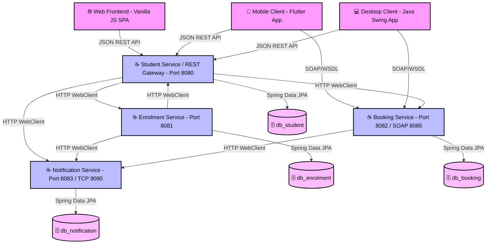

# 🎓 Smart Campus Connect (Microservices Architecture)

SmartCampus Connect is a distributed, multi-platform campus management system. It has been refactored from a monolithic backend to a fully decoupled **Microservices / Service-Oriented Architecture (SOA)**, satisfying database isolation per service, inter-service API orchestration/composition, multithreading protections, and multi-protocol clients (REST + SOAP).

It provides campus automation services across three different clients (**Web**, **Mobile**, and **Desktop**) communicating with the gateway microservice API and a set of dedicated MySQL databases.

---

## 🏗️ System Architecture & Services

The system is designed with a decoupled microservices architecture containing the following components:



1. **Student Service (`/backend`) [Port 8080]**: Handles student profiles, authentication, sessions, acts as the API Gateway/Proxy, and hosts the Personal Dashboard aggregator. Connects to `db_student`.
2. **Enrolment Service (`/enrolment-service`) [Port 8081]**: Exposes course registration, capacity checks, and load test endpoints. Connects to `db_enrolment`.
3. **Booking Service (`/booking-service`) [Port 8082 REST / Port 8085 SOAP]**: Exposes library catalog Search and Room/Book bookings. Connects to `db_booking`.
4. **Notification Service (`/notification-service`) [Port 8083 HTTP / Port 9090 TCP]**: Implements the asynchronous notification logger. Connects to `db_notification`.
5. **Web Client (`/web`)**: Served via **Nginx** on port `3000`.
6. **Mobile Client (`/mobile`)**: Flutter client calling REST APIs via the gateway and SOAP via port 8085.
7. **Desktop Client (`/desktop`)**: Swing client calling REST APIs via the gateway and SOAP via port 8085.

---

## 🎓 Coursework Compliance Matrix (R1 - R10)

| Requirement | Concept (Week) | Implementation Details & Mapping |
| :--- | :--- | :--- |
| **R1: System Characterisation** | Week 1 | • Decoupled Microservices with location/access transparency via Gateway Proxies.<br>• Graceful degradation and connection mitigation using decoupled HTTP WebClient fallbacks. |
| **R2: Architectural Pattern** | Week 2 | • **Multi-tier Microservices**: Separates client presentations from business logic layers and isolates persistence stores. |
| **R3: SOA Principles** | Week 3 | • Strict separation of services: Student, Enrolment, Booking/Library, and Notifications.<br>• **Database-per-Service**: Decoupled databases (`db_student`, `db_enrolment`, `db_booking`, `db_notification`). |
| **R4: Service Composition** | Week 3 | • Student Service (Dashboard) orchestrates REST aggregation across three other microservices to render the client personal board.<br>• Enrolment and Booking services compose with Notification Service via async-like HTTP calls. |
| **R5: Multithreaded Server** | Week 4 | • enrolment-service utilizes a fairness-mode `ReentrantLock` to protect course capacity concurrency states during registration load tests. |
| **R6: Distributed Messaging** | Week 5 | • Implements a custom non-blocking notification server listening on TCP Socket port `9090` (Producer-Consumer pattern). |
| **R7: REST API** | Week 6 | • Microservices expose clean HTTP/REST APIs. Gateway Proxy Controllers routing to `/api/enrol`, `/api/courses`, and `/api/notifications` ensure complete frontend compatibility. |
| **R8: SOAP Service** | Week 7 | • Legacy system SOAP/WSDL endpoints exposed in **booking-service** on port `8085` using JAX-WS. |
| **R9: Failure Handling** | Weeks 1, 4 | • Isolated microservices prevent cascade failures; failing to query one service fallback to empty list data without crashing the dashboard. |
| **R10: Version Control & Build** | Engineering Practice | • Decoupled build containers configured in `docker-compose.yml` allowing single-command startup. |

---

## ⚡ Running with Docker (Highly Recommended)

Make sure **Docker Desktop** is open and running, then execute:

```bash
docker-compose up --build
```

### Port Mappings on Host:
*   **Web Frontend App**: [http://localhost:3000](http://localhost:3000)
*   **Student Service / Gateway API**: [http://localhost:8080](http://localhost:8080)
*   **Enrolment Service**: [http://localhost:8081](http://localhost:8081)
*   **Booking Service (REST)**: [http://localhost:8082](http://localhost:8082)
*   **SOAP Endpoint**: [http://localhost:8085/ws/booking?wsdl](http://localhost:8085/ws/booking?wsdl)
*   **Notification Service (HTTP)**: [http://localhost:8083](http://localhost:8083)
*   **Notification Service (TCP)**: [tcp://localhost:9090](tcp://localhost:9090)

---

## 🌐 API Reference & Directory (Gateway Port 8080)

All HTTP REST endpoints listed below are routed via the Gateway (`student-service` on port `8080`) to ensure backend location transparency.

### 🔐 1. Authentication Service
*   **POST** `/api/auth/login`
    *   *Description*: Logs in a user by ID only (matric number or `ADMIN`).
    *   *Payload*: `{ "userId": "B032310001" }`
    *   *Response*: `200 OK` with session token UUID.
*   **GET** `/api/auth/me`
    *   *Description*: Retrieves active session context (requires `X-Auth-Token` header).
    *   *Response*: `200 OK` with user context or `401 Unauthorized`.
*   **POST** `/api/auth/logout`
    *   *Description*: Invalidates and destroys the active session (requires `X-Auth-Token` header).
    *   *Response*: `200 OK`.

### 👤 2. Student Profile Service
*   **GET** `/api/students`
    *   *Description*: Lists all student profiles in the database.
    *   *Response*: `200 OK` with JSON array.
*   **GET** `/api/students/{matricNo}`
    *   *Description*: Retrieves a specific student profile by their matriculation number.
    *   *Response*: `200 OK` or `404 Not Found`.
*   **GET** `/api/students/id/{id}`
    *   *Description*: Retrieves a student profile by their database auto-increment ID.
    *   *Response*: `200 OK` or `404 Not Found`.
*   **POST** `/api/students`
    *   *Description*: Registers a new student. Also auto-creates login credentials.
    *   *Payload*: `{ "name": "Amin", "email": "amin@...", "programme": "...", "faculty": "FTMK", "semester": "1", "gpa": 3.60, "phoneNumber": "..." }`
    *   *Response*: `201 Created`.
*   **PUT** `/api/students/{id}`
    *   *Description*: Updates profile info by database ID.
    *   *Response*: `200 OK`.
*   **DELETE** `/api/students/{id}`
    *   *Description*: Deletes a student record and cascades to destroy login credentials.
    *   *Response*: `204 No Content`.

### 📝 3. Course Enrolment Service
*   **GET** `/api/courses`
    *   *Description*: Returns a list of all courses.
    *   *Response*: `200 OK`.
*   **GET** `/api/courses/{id}`
    *   *Description*: Gets a course by database ID.
*   **GET** `/api/courses/code/{courseCode}`
    *   *Description*: Gets course details by course code (e.g. `BITP3123`).
*   **POST** `/api/courses`
    *   *Description*: Creates a new course offering.
    *   *Response*: `201 Created`.
*   **PUT** `/api/courses/{id}`
    *   *Description*: Updates course parameters.
*   **DELETE** `/api/courses/{id}`
    *   *Description*: Drops a course from the curriculum.
*   **POST** `/api/enrol`
    *   *Description*: Enrolls a student into a course. Protected by `ReentrantLock` (R5).
    *   *Payload*: `{ "studentId": 1, "courseCode": "BITP3123" }`
    *   *Response*: `201 Created` or `400 Bad Request`.
*   **DELETE** `/api/enrol/{studentId}/{courseCode}`
    *   *Description*: Drops a course registration.
*   **GET** `/api/enrol/student/{studentId}`
    *   *Description*: Gets all course registrations for a student.
*   **GET** `/api/enrol/course/{courseCode}`
    *   *Description*: Gets all student enrolments in a course.
*   **POST** `/api/enrol/load-test/{courseCode}`
    *   *Description*: Triggers the multithreaded registration load test (10 concurrent threads to book remaining 3 seats).

### 🏛️ 4. Booking & Library Service (SOAP/WSDL - Port 8085)
*   **POST** `http://localhost:8085/ws/booking`
    *   *Operations*:
        *   `bookRoom(studentId, studentName, roomName, slot, date, purpose)`: Confirms a room booking.
        *   `checkAvailability(roomName, slot, date)`: Checks slot availability.
        *   `cancelBooking(bookingRef)`: Cancels a booking reference.
        *   `borrowBook(token, studentId, studentName, isbn, dueDate)`: Admin lends a book.
        *   `returnBook(token, loanRef)`: Admin records a book return (calculates fine).
        *   `addBook(token, isbn, title, author, category)`: Admin adds a book.
        *   `searchBooks(query)`: Searches book catalog.
        *   `getBookLoanHistory(token, isbn)`: Gets history for a book.
        *   `getStudentLoanHistory(token, studentId)`: Gets loan history for a student.

### 🔔 5. Notification Service
*   **GET** `/api/notifications`
    *   *Description*: Lists all logged system alerts.
*   **GET** `/api/notifications/recipient/{recipientId}`
    *   *Description*: Retrieves logs for a specific recipient (matric number).

---

## 🗄️ Data Dictionary (Database Schemas)

Each microservice operates on its own dedicated MySQL database to enforce data layer isolation.

### 1. `db_student` (Student & Session Storage)

#### Table: `users`
*   `id` (BIGINT, PK, Auto-Increment): Internal surrogate identifier.
*   `user_id` (VARCHAR(20), Unique, Indexed): Student matriculation number or `ADMIN`.
*   `role` (ENUM('STUDENT', 'ADMIN')): Defines access role.
*   `full_name` (VARCHAR(100)): User display name.
*   `created_at` (DATETIME): User account creation timestamp.

#### Table: `user_sessions`
*   `id` (BIGINT, PK, Auto-Increment): Session primary identifier.
*   `token` (VARCHAR(100), Unique, Indexed): Session UUID.
*   `user_id` (VARCHAR(20)): Matric number or `ADMIN`.
*   `role` (ENUM('STUDENT', 'ADMIN')): Active session role.
*   `full_name` (VARCHAR(100)): Cached display name.
*   `created_at` (DATETIME): Session creation timestamp.
*   `expires_at` (DATETIME): Expiration deadline (default 24 hours).

#### Table: `students`
*   `id` (BIGINT, PK, Auto-Increment): Student primary key.
*   `student_id` (VARCHAR(20), Unique): Student matriculation number (e.g. `B032310001`).
*   `name` (VARCHAR(100)): Full name.
*   `email` (VARCHAR(150), Unique): Institutional email.
*   `programme` (VARCHAR(100)): Major field of study.
*   `faculty` (VARCHAR(50)): Faculty identifier (e.g. `FTMK`).
*   `semester` (VARCHAR(10)): Current semester index.
*   `gpa` (DECIMAL(4,2)): Cumulative grade point average.
*   `phone_number` (VARCHAR(15)): Contact number.
*   `created_at` (DATETIME): Creation date.
*   `updated_at` (DATETIME): Last update timestamp.

---

### 2. `db_enrolment` (Course & Registration Storage)

#### Table: `courses`
*   `id` (BIGINT, PK, Auto-Increment): Course PK.
*   `course_code` (VARCHAR(20), Unique): e.g. `BITP3123`.
*   `course_title` (VARCHAR(150)): Full title.
*   `lecturer` (VARCHAR(100)): Lecturer name.
*   `faculty` (VARCHAR(50)): Hosting faculty.
*   `credit_hours` (INT): Credit weights (default 3).
*   `current_capacity` (INT): Current enrolled seat count.
*   `max_capacity` (INT): Maximum capacity limit.
*   `semester` (VARCHAR(20)): Semester code.
*   `created_at` (DATETIME): Creation timestamp.

#### Table: `enrolments`
*   `id` (BIGINT, PK, Auto-Increment): Enrolment PK.
*   `student_id` (BIGINT, Composite Unique key with course_code): Logical key pointing to Student ID on `db_student`.
*   `course_code` (VARCHAR(20), Composite Unique key with student_id): Course code.
*   `student_name` (VARCHAR(100)): Denormalized student name.
*   `course_title` (VARCHAR(150)): Denormalized course title.
*   `status` (ENUM('ACTIVE', 'DROPPED', 'COMPLETED')): Enrolment status.
*   `enrolled_at` (DATETIME): Enrolment timestamp.
*   `dropped_at` (DATETIME): Dropped timestamp.

---

### 3. `db_booking` (Library & Room Reservation Storage)

#### Table: `books`
*   `id` (BIGINT, PK, Auto-Increment): Book PK.
*   `isbn` (VARCHAR(20), Unique): Book ISBN-13 identifier.
*   `title` (VARCHAR(200)): Book title.
*   `author` (VARCHAR(150)): Author name.
*   `category` (VARCHAR(100)): Book category/genre.
*   `status` (ENUM('AVAILABLE', 'BORROWED')): Book availability.
*   `created_at` (DATETIME): Creation timestamp.

#### Table: `book_loans`
*   `id` (BIGINT, PK, Auto-Increment): Loan PK.
*   `loan_reference` (VARCHAR(30), Unique): e.g. `LN-20260619-123`.
*   `student_id` (VARCHAR(20)): Student matric number.
*   `student_name` (VARCHAR(100)): Student name.
*   `book_isbn` (VARCHAR(20)): ISBN of borrowed book.
*   `book_title` (VARCHAR(200)): Title of borrowed book.
*   `loan_date` (DATE): Loan date.
*   `due_date` (DATE): Return deadline date.
*   `return_date` (DATE, Nullable): Return date.
*   `status` (ENUM('BORROWED', 'RETURNED', 'OVERDUE', 'LOST')): Loan status.
*   `fine_amount` (DECIMAL(8,2)): Calculated late return fine in RM.

#### Table: `room_bookings`
*   `id` (BIGINT, PK, Auto-Increment): Booking PK.
*   `booking_reference` (VARCHAR(30), Unique): e.g. `BK-20260619-123`.
*   `student_id` (VARCHAR(20)): Student matric number.
*   `student_name` (VARCHAR(100)): Student name.
*   `room_name` (VARCHAR(50), Composite Unique key with slot & booking_date): Room name.
*   `slot` (VARCHAR(50), Composite Unique key): e.g. `10:00-12:00`.
*   `booking_date` (DATE, Composite Unique key): Booking date.
*   `status` (ENUM('CONFIRMED', 'CANCELLED', 'COMPLETED')): Booking status.
*   `purpose` (VARCHAR(300)): Booking purpose.
*   `booked_at` (DATETIME): Booking timestamp.
*   `cancelled_at` (DATETIME): Cancellation timestamp.

---

### 4. `db_notification` (System Alert Logs)

#### Table: `notifications`
*   `id` (BIGINT, PK, Auto-Increment): Notification PK.
*   `type` (VARCHAR(30)): e.g. `ENROLMENT_SUCCESS`, `ROOM_BOOKED`.
*   `recipient_id` (VARCHAR(20)): Target recipient matric number or `ADMIN`.
*   `recipient_name` (VARCHAR(100)): Target recipient name.
*   `message` (VARCHAR(500)): Log message text.
*   `related_entity` (VARCHAR(50)): Associated reference code/id.
*   `delivery_status` (VARCHAR(10)): `SENT` or `FAILED`.
*   `channel` (VARCHAR(20)): Connection channel (e.g. `HTTP`, `TCP_SOCKET`).
*   `created_at` (DATETIME): Alert timestamp.

---

## 📁 Project File Structure

```text
SmartCampusConnect/
├── .env                       # Global environment ports & database credentials
├── docker-compose.yml         # 4 Microservices + 4 isolated DBs setup
├── backend/                   # ☕ Student Service & REST Gateway
├── enrolment-service/         # ☕ Enrolment Microservice
├── booking-service/           # ☕ Booking & SOAP Microservice
├── notification-service/      # ☕ Notification & TCP Microservice
├── web/                       # 🌐 Web Client SPA
├── mobile/                    # 📱 Mobile Client (Flutter)
└── desktop/                   # 💻 Desktop Client (Java Swing)
```